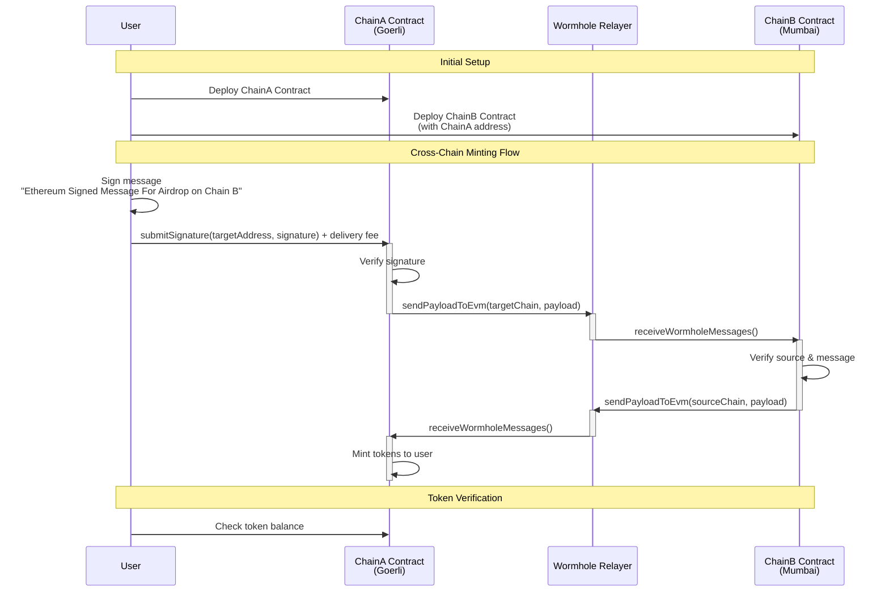

# Cross-Chain Token Minting Flow

## Contract Interaction Sequence

```mermaid
sequenceDiagram
    participant User
    participant ChainA as ChainA Contract<br/>(Goerli)
    participant WormholeRelay as Wormhole Relayer
    participant ChainB as ChainB Contract<br/>(Mumbai)
    
    Note over User,ChainB: Initial Setup
    User->>ChainA: Deploy ChainA Contract
    User->>ChainB: Deploy ChainB Contract<br/>(with ChainA address)
    
    Note over User,ChainB: Cross-Chain Minting Flow
    User->>User: Sign message<br/>"Ethereum Signed Message For Airdrop on Chain B"
    User->>ChainA: submitSignature(targetAddress, signature) + delivery fee
    
    activate ChainA
    ChainA->>ChainA: Verify signature
    ChainA->>WormholeRelay: sendPayloadToEvm(targetChain, payload)
    deactivate ChainA
    
    activate WormholeRelay
    WormholeRelay->>ChainB: receiveWormholeMessages()
    deactivate WormholeRelay
    
    activate ChainB
    ChainB->>ChainB: Verify source & message
    ChainB->>WormholeRelay: sendPayloadToEvm(sourceChain, payload)
    deactivate ChainB
    
    activate WormholeRelay
    WormholeRelay->>ChainA: receiveWormholeMessages()
    deactivate WormholeRelay
    
    activate ChainA
    ChainA->>ChainA: Mint tokens to user
    deactivate ChainA
    
    Note over User,ChainB: Token Verification
    User->>ChainA: Check token balance
```